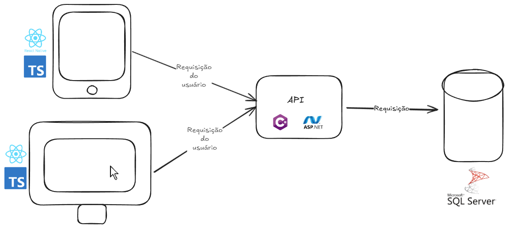

# Introdução

O setor de turismo, no qual se inclui o segmento de hotelaria, ocupa hoje papel relevante na economia mundial, sendo
uma das atividades com maior representatividade econômica, ao lado da indústria do petróleo. Segundo informações do Instituto Brasileiro de Turismo (Embratur), o turismo se configura como uma atividade que gera anualmente US$ 4 trilhões e aproximadamente 280 milhões de empregos em todo o mundo.

A indústria da hospitalidade, termo amplo, inclui uma variedade de organizações e negócios interdependentes, como hotéis,
restaurantes, atrativos turísticos, meios de transporte, agências de viagem, entretenimento e serviços voltados para o atendimento ao turista.

O Censo de Serviços do IBGE de 2002 aponta a existência de 23.366 empresas de “serviços de alojamento” no Brasil, o que
incluiria não apenas hotéis, mas também pousadas, hotéis-fazenda, pensões, motéis etc., com 244 mil pessoas ocupadas nesses estabelecimentos.

O Guia Quatro Rodas de 2005 (informações atualizadas até agosto de 2004) faz uma lista 5.557 hotéis, pousadas e hotéis fazenda, esclarecendo que ela não abrange a totalidade dos empreendimentos existentes, mas apenas aqueles considerados acima de determinado ponto de corte, estabelecido pelos editores. Por sua vez, a publicação eletrônica Onde Hospedar (www.ondehospedar.com.br), o mais completo diretório da hotelaria brasileira, aponta 14.914 meios de hospedagem no Brasil: 9.943 hotéis, 4.094 pousadas, 532 hotéis-fazenda e 345 apart-hotéis, com seus respectivos endereços. Outra fonte de dados do setor, a Hotel Investment Advisors (HIA), estima que cerca de 70% das UHs (Unidades Habitacionais) existentes no país são operados por hotéis independentes das redes.

Com este contexto, o projeto aborda uma solução tecnológica para um hotel fazenda no município de Capitólio que se tornou um importante destino turístico de Minas Gerais, muito procurado nos últimos anos por conta de suas belas cachoeiras e rios de águas transparentes. O Cânion de Furnas é uma das diversas belezas naturais na região, soma-se a isso a proximidade  com a Serra da Canastra, formação rochosa no formato de mesa, onde se encontra a nascente do rio São Francisco e da cachoeira Casca d'Anta, dentro da área do Parque Nacional da Serra da Canastra, habitat do lobo guará, veado-campeiro, onça parda, tatu-canastra, ema, pato-mergulhão, perdiz, perdiz do cerrado, inhambu e uma infinidade de aves. De frente à Serra da Canastra, sua vizinha e gêmea Serra da Babilônia é explorada, inclusive, pelo balonismo.

## Problema
Durante a observação de um hotel-fazenda localizado em Capitólio/MG, foi identificado que os processos de hospedagem e de consumo no restaurante são realizados de forma manual. Essa prática, comum em empreendimentos de pequeno e médio porte, mostra-se ineficiente, morosa e pouco segura, prejudicando a experiência dos hóspedes e a organização do estabelecimento.

Entre os principais problemas encontrados estão:
- Utilização de blocos de papel pelos funcionarios para registrar e controlar os pedidos;
- erros frequentes no registro de pedido feito pelos funcionários, havendo espaço para registros em outras hospedagem por erros ou corrupção;
- ausência de controle efetivo sobre consumo e estoque pois os dados estão em cadernos ou blocos de papel;
- dificuldade no fechamento das contas no momento do check-out;
- experiência negativa e insatisfação dos clientes.

Esse cenário demonstra a necessidade de modernização na forma como o hotel conduz suas atividades, de modo a oferecer maior eficiência operacional e uma experiência mais satisfatória ao hóspede.

## Objetivos

O objetivo geral deste projeto é desenvolver uma plataforma distribuída capaz de integrar, em tempo real, os processos de hospedagem e restaurante de um hotel-fazenda em Capitólio/MG, com vistas a reduzir erros operacionais, agilizar o atendimento, proporcionar ao hóspede uma experiência personalizada e oferecer ao hotel mecanismos mais eficientes de gestão de consumo, estoque e faturamento.

## Objetivos Específicos
- Implementar um módulo de pedidos digitais integrado ao quarto do hóspede, permitindo que os consumos feitos no restaurante sejam registrados em tempo real e vinculados à hospedagem.
- Desenvolver relatórios gerenciais automatizados que consolidem dados de hospedagem, pedidos e estoque, apoiando a administração na tomada de decisões mais ágil e precisa.
 
## Justificativa

A automatização dos processos de hospedagem e de consumo representa uma estratégia essencial para elevar a qualidade do serviço prestado e a satisfação dos clientes. Do ponto de vista do hóspede, a inovação oferece maior comodidade, rapidez no atendimento e segurança no registro de consumos. Para o hotel, o ganho está no controle mais rigoroso de estoque, na redução de falhas humanas e no aumento da confiabilidade das informações financeiras.

A escolha por uma solução distribuída é relevante porque possibilita escalabilidade, confiabilidade e acesso simultâneo em diferentes pontos do hotel, como recepção, restaurante, dispositivos móveis dos garçons e até mesmo aplicações voltadas ao cliente. Dessa forma, a proposta não apenas resolve problemas operacionais imediatos, mas também posiciona o empreendimento em alinhamento com as práticas mais modernas de gestão hoteleira.

## Público-Alvo

O sistema será utilizado por diferentes perfis de usuários no ambiente do hotel-fazenda, cada qual com características, níveis de familiaridade tecnológica e necessidades distintas.

Hóspedes (público primário):
Os hóspedes representam um público heterogêneo, composto por famílias, casais e grupos de amigos que buscam lazer em Capitólio. A familiaridade com tecnologia é variada, indo de pessoas altamente habituadas ao uso de aplicativos móveis até aquelas que encontram dificuldades em lidar com recursos digitais. Suas principais necessidades envolvem praticidade no check-in, agilidade no atendimento, pedidos corretos no restaurante e integração transparente dos consumos ao fechamento da conta.

Equipe operacional (público secundário):
- Recepcionistas: possuem conhecimento intermediário em sistemas de gestão, necessitando de ferramentas ágeis para check-in e check-out.
- Garçons: em geral, apresentam pouca familiaridade com tecnologias mais avançadas, o que exige interfaces simples, objetivas e rápidas para registro de pedidos.
- Gerentes e administradores: possuem maior experiência em relatórios e indicadores e precisam de dashboards claros e confiáveis para apoiar a gestão estratégica do hotel.
Hierarquicamente, esses grupos se organizam de forma subordinada: funcionários → gerência → administração/diretoria.

Personas

1- Maria, 34 anos – Hóspede: turista que viaja com a família, utiliza smartphone diariamente, prefere sistemas simples e deseja rapidez no atendimento.

2- João, 25 anos – Garçom: funcionário do restaurante, tem pouco tempo para treinar em novas tecnologias e precisa registrar pedidos com agilidade e sem falhas.

3- Carlos, 45 anos – Gerente: responsável pelo controle operacional, habituado a planilhas, busca relatórios confiáveis e em tempo real para tomada de decisão.

Esse conjunto de perfis e suas necessidades evidencia a importância de um sistema que seja, ao mesmo tempo, acessível, intuitivo e robusto, atendendo tanto às expectativas dos hóspedes quanto às demandas internas da gestão hoteleira.

# Especificações do Projeto

## Requisitos

As tabelas a seguir detalham os **requisitos funcionais e não funcionais** da solução, organizados de acordo com as necessidades levantadas no contexto do hotel fazenda em Capitólio. Para definição de prioridades, foi utilizada a técnica **MoSCoW**, adaptada para português:

- **Essencial**: requisito obrigatório para o funcionamento do sistema.  
- **Importante**: relevante, mas pode ser entregue após os essenciais.  
- **Desejável**: agrega valor, mas não é prioritário.  
- **Não será implementado**: está fora do escopo atual.

### Requisitos Funcionais

|ID    | Descrição do Requisito  | Prioridade |
|------|-----------------------------------------|----|
|RF-001| Permitir que o usuário peça tarefas | MÉDIA | 
|RF-002| Permitir que o usuário tenha acesso aos gastos já realizados | MÉDIA |
|RF-003| Permitir gestão de usuário | ALTA |
|RF-004| Permitir gestão de produtos | ALTA |
|RF-005| Disponibilizar cardápio digital para consulta pelo hóspede ou lançamento de pedidos | ALTA |
|RF-006| Permitir ao garçom registrar pedidos diretamente no sistema via dispositivo móvel | ALTA |

### Requisitos não Funcionais

|ID     | Descrição do Requisito  |Prioridade |
|-------|-------------------------|----|
|RNF-001| O sistema deve ser responsivo para rodar em um dispositivos móvel | Essencial | 
|RNF-002| O tempo de resposta para operações críticas (lançar pedido, vincular consumo) ≤ 2s | Importante |
|RNF-003| Garantir *segurança dos dados*, com autenticação, controle de acesso e criptografia | Essencial |
|RNF-004| O sistema deve estar disponível com *uptime mínimo de 99%* no horário comercial | Importante |
|RNF-005| Manter *trilhas de auditoria* para pedidos, movimentação de estoque e fechamento | Importante |
|RNF-006| Interfaces devem ser *intuitivas*, exigindo no máximo três cliques para registrar um pedido | Desejável |

## Restrições

O projeto está restrito pelos itens apresentados na tabela a seguir.

|ID| Restrição                                             |
|--|-------------------------------------------------------|
|01| O projeto deverá ser entregue até o final do semestre |
|02| O projeto contará apenas com a equipe de 6 alunos, sem contratação externa |
|03| Não serão utilizados dados reais de hóspedes, apenas massa fictícia de teste |

# Catálogo de Serviços

O sistema proposto será composto por um conjunto de serviços que refletem as principais operações do hotel fazenda, abrangendo hospedagem, restaurante, estoque, finanças, relatórios e autenticação.
  
O **Serviço de Restaurante** será responsável pela disponibilização de um cardápio digital tanto para hóspedes quanto para a equipe, pelo registro de pedidos via dispositivos móveis pelos garçons ou diretamente pelo hóspede, pelo acompanhamento do status dos pedidos (em preparo, entregue) e pela integração automática das solicitações com a hospedagem e o controle de estoque.  

O **Serviço de Estoque** possibilitará o cadastro de insumos e produtos, a baixa automática de itens a cada pedido realizado, a geração de alertas para reposição quando o nível mínimo for atingido e a emissão de relatórios de movimentação de insumos e produtos.
  
O **Serviço de Autenticação e Perfis** será responsável pelo cadastro e gerenciamento de usuários do sistema, pelo controle de permissões de acordo com os perfis (recepção, garçom, gerente, administrador) e pela auditoria de acessos e atividades realizadas.  

Por fim, o **Serviço de Notificações**, considerado desejável, possibilitará o envio de mensagens aos hóspedes informando sobre pedidos concluídos, o disparo de alertas para a gerência em situações de baixa de estoque.  

# Arquitetura da Solução

## Tecnologias Utilizadas  

Este projeto consiste em um sistema com duas interfaces de usuário principais: uma aplicação web e um aplicativo móvel. Ambas as interfaces se comunicam com a mesma API, garantindo uma experiência prática e consistente, seja no navegador ou no celular.

**Frontend**

Aplicação Web: Desenvolvida em React usando TypeScript, HTML5 e CSS3 Para estruturação e estilização das páginas web.

Aplicação Mobile: Criado com o React Native usando TypeScript.

Comunicação: Utiliza a biblioteca Axios para requisições HTTP.

Editor de Código: Visual Studio Code.

**Backend**

API: Desenvolvida em ASP.NET usando C#. Concentra as regras de negócio e a lógica do sistema.

Banco de Dados: SQL Server, responsável por armazenar dados de hospedagem, pedidos, estoque e faturamento.

Acesso ao Banco: Utiliza o Entity Framework Core.

Editor de Código: Visual Studio.

Versionamento
Para o controle de versão do código, o Git é utilizado.

## Hospedagem

A aplicação web será hospedada em uma VPS (Servidor Virtual Privado) fornecida pela OVH, uma das maiores provedoras de infraestrutura em nuvem. A escolha por uma VPS garante maior controle sobre o ambiente de hospedagem, possibilitando a configuração personalizada dos serviços, maior desempenho e segurança.

A VPS contará com um sistema operacional Linux (Ubuntu Server), com as dependências necessárias instaladas para rodar ambos os ambientes (Node.js para o build do React, .NET SDK e runtime para a aplicação ASP.NET)

# Planejamento

## Quadro de Tarefas

O grupo foi organizado em etapas semanais para desenvolver os artefatos da **Etapa 1 – Planejamento de um Sistema Distribuído**. Abaixo está a divisão de tarefas, prazos e status de acompanhamento.

---

### Semana 1 – Contexto do Projeto

Atualizado em: 15/08/2025

| Responsável                  | Tarefa/Requisito                  | Iniciado em | Prazo     | Status | Terminado em |
|------------------------------|------------------------------------|:-----------:|:---------:|:------:|:------------:|
| Júnio dos Reis Firmino       | Redigir Introdução e Contexto      | 05/08/2025  | 10/08/2025| ✔️     | 09/08/2025   |
| Júnio dos Reis Firmino       | Definir Problema                   | 05/08/2025  | 10/08/2025| ✔️     | 09/08/2025   |
| Déborah Thaís de Matos       | Elaborar Justificativa             | 06/08/2025  | 11/08/2025| ✔️     | 11/08/2025   |
| Carlos Eduardo de Lima Assis | Definir Objetivos (geral e específicos) | 06/08/2025  | 12/08/2025| ✔️     | 12/08/2025   |
| Andre Murilo Neves Vasconcelos | Criar Público-Alvo e Personas    | 07/08/2025  | 13/08/2025| ✔️     | 13/08/2025   |
| Todos os alunos              | Revisar Documentação da Semana 1   | 08/08/2025  | 14/08/2025| ✔️     | 14/08/2025   |

---

### Semana 2 – Especificações e Catálogo

Atualizado em: 22/08/2025

| Responsável                  | Tarefa/Requisito                        | Iniciado em | Prazo     | Status | Terminado em |
|------------------------------|------------------------------------------|:-----------:|:---------:|:------:|:------------:|
| Déborah Thaís de Matos       | Levantar Requisitos Funcionais           | 15/08/2025  | 19/08/2025| ✔️     | 19/08/2025   |
| Carlos Eduardo de Lima Assis | Levantar Requisitos Não Funcionais       | 15/08/2025  | 19/08/2025| ✔️     | 19/08/2025   |
| Andre Murilo Neves Vasconcelos | Elaborar Catálogo de Serviços          | 16/08/2025  | 20/08/2025| ✔️     | 20/08/2025   |
| Raphael Lucas Oliveira dos Santos | Definir Restrições do Projeto       | 16/08/2025  | 20/08/2025| ✔️     | 20/08/2025   |
| Todos os alunos              | Revisar Entregas da Semana 1             | 17/08/2025  | 21/08/2025| ✔️     | 21/08/2025   |

---

### Semana 3 – Arquitetura e Consolidação

Atualizado em: 29/08/2025

| Responsável                  | Tarefa/Requisito                      | Iniciado em | Prazo     | Status | Terminado em |
|------------------------------|----------------------------------------|:-----------:|:---------:|:------:|:------------:|
| Carlos Eduardo de Lima Assis | Documentar Arquitetura da Solução      | 22/08/2025  | 26/08/2025| ✔️     | 26/08/2025   |
| Déborah Thaís de Matos       | Definir Tecnologias Utilizadas         | 22/08/2025  | 26/08/2025| ✔️     | 26/08/2025   |
| Andre Murilo Neves Vasconcelos | Descrever Estratégia de Hospedagem   | 23/08/2025  | 27/08/2025| ✔️     | 27/08/2025   |
| Raphael Lucas Oliveira dos Santos | Consolidar Documento Final da Etapa 1 | 24/08/2025  | 28/08/2025| ✔️     | 28/08/2025   |
| Todos os alunos              | Revisar Arquitetura da Solução         | 24/08/2025  | 28/08/2025| ✔️     | 28/08/2025   |

---

### Semana 4 – Revisão Geral

Atualizado em: 31/08/2025

| Responsável   | Tarefa/Requisito             | Iniciado em | Prazo     | Status | Terminado em |
|---------------|-------------------------------|:-----------:|:---------:|:------:|:------------:|
| Todos os alunos | Revisão Geral da Documentação | 29/08/2025  | 31/08/2025| ✔️     | 31/08/2025   |

---

### Legenda de Status

- ✔️: Terminado  
- 📝: Em execução  
- ⌛: Atrasado  
- ❌: Não iniciado  

# APIs e Web Services

Para este projeto, foi desenvolvida uma API RESTful robusta que atua como o componente central do sistema de gestão do hotel-fazenda. A API centraliza todas as regras de negócio e o acesso aos dados, fornecendo uma interface segura e bem definida para que as aplicações cliente (como o frontend web e o aplicativo móvel) possam consumir e manipular as informações do sistema.

---

## Objetivos da API

O objetivo principal da API é fornecer um conjunto de **endpoints seguros e performáticos** para gerenciar as entidades centrais do sistema.  

Os objetivos da API abrangem desde a gestão completa de usuários e autenticação, que servirá como pilar de segurança para o sistema, até as funcionalidades essenciais do hotel, como o controle de hospedagens, o gerenciamento de produtos e o registro de pedidos do restaurante.

---

### Modelagem da Aplicação

A arquitetura da API foi estruturada seguindo o padrão **Controller-Service-Repository**, visando uma clara separação de responsabilidades e facilitando a manutenção e a testabilidade do código.

- **Controllers**: Camada mais externa, responsável por receber as requisições HTTP, validar os dados de entrada e orquestrar as respostas.  
- **Services**: Onde residem as regras de negócio. Exemplo: criptografia da senha antes de salvar no banco.  
- **Repositories**: Camada de acesso a dados, responsável pela comunicação com o banco via **Entity Framework Core**.

A principal entidade definida até o momento é a de **User**, que contém informações como:

- `Id`
- `Name`
- `Email`
- `PasswordHash`
- `Role` (enum: `Admin`, `Gerente`, `Hospede`)

Para a comunicação com o cliente, foram criados **DTOs** como `CreateUserDto` e `UserViewDto`, garantindo que apenas os dados necessários e seguros sejam expostos pela API.

Para a entidade **Produtos** temos as seguintes informções:

- `Id`
- `Name`
- `Preco`
- `Estoque`

---

### Tecnologias Utilizadas

- **.NET 9 / ASP.NET Core** → Criação dos endpoints RESTful  
- **Entity Framework Core** → Persistência de dados (SQL Server)  
- **EF Core Migrations** → Versionamento do esquema do banco  
- **JWT** → Autenticação  
- **BCrypt.Net-Next** → Hash de senhas  
- **Swagger (OpenAPI)** → Documentação e testes interativos  

---

### API Endpoints

Os endpoints são organizados por recursos. Atualmente:

#### Autenticação
- **POST** `/api/auth/login` → Recebe e-mail e senha e retorna um **JWT** válido.

#### Usuários
- **GET** `/api/users` → Retorna todos os usuários (**Admin/Gerente**)  
- **GET** `/api/users/{id}` → Retorna usuário específico (**Admin/Gerente**)  
- **POST** `/api/users` → Cria novo usuário (**Público**)  
- **PUT** `/api/users/{id}` → Atualiza usuário (**Admin**)  
- **DELETE** `/api/users/{id}` → Remove usuário (**Admin**)

#### Produtos

- **GET** `/api/produto` → Retorna todos os produtos (**Admin**)  
- **GET** `/api/produto/{id}` → Retorna produto específico (**Admin**)  
- **POST** `/api/produto` → Cria novo produto (**Admin**)  
- **PUT** `/api/produto/{id}` → Atualiza produto (**Admin**)  
- **DELETE** `/api/produto/{id}` → Remove produto (**Admin**)

---

### Considerações de Segurança

- **Autenticação** via login que gera **JWT** assinado.  
- **Autorização** baseada em **Role-Based Access Control (RBAC)**.  
- Uso do atributo `[Authorize]` nos endpoints para restrição de acesso.  
- **Senhas nunca em texto plano**: sempre hash com **BCrypt**.  

---

### Implantação

---

### Testes

- **Swagger UI** → Testes interativos rápidos, com a [documentação e evidências dos testes disponível aqui](https://sgapucminasbr-my.sharepoint.com/personal/1473720_sga_pucminas_br/_layouts/15/guestaccess.aspx?share=ETOvDMKM81tBv46wyxfZB_AB6CZnFM1sv2n0wfzCfWRZvg&rtime=E8VQDycE3kg).
---

# Referências

* **[Documentação Oficial do ASP.NET Core - Microsoft](https://learn.microsoft.com/pt-br/aspnet/core/)**
  * Principal fonte de consulta para a estrutura da API, configuração de serviços, middleware e melhores práticas da plataforma.

* **[Documentação Oficial do Entity Framework Core - Microsoft](https://learn.microsoft.com/pt-br/ef/core/)**
  * Referência para toda a camada de acesso a dados, incluindo configuração do DbContext, mapeamento de entidades, migrations e consultas.

* **[JSON Web Tokens (JWT)](https://jwt.io/)**
  * Site oficial com a especificação e ferramentas para depuração de tokens JWT, utilizado como base para a implementação da autenticação.

* **[Swashbuckle.AspNetCore - Repositório no GitHub](https://github.com/domaindrivendev/Swashbuckle.AspNetCore)**
  * Biblioteca utilizada para a geração da documentação interativa da API (Swagger UI). O repositório contém informações de configuração e uso.

* **[BCrypt.Net - Repositório no GitHub](https://github.com/BcryptNet/bcrypt.net)**
  * Referência da biblioteca utilizada para o hashing seguro das senhas de usuário, fundamental para a camada de segurança.

* **[Diretrizes de design de API REST - Microsoft Azure](https://learn.microsoft.com/pt-br/azure/architecture/best-practices/api-design)**
  * Um guia de melhores práticas para a construção de APIs RESTful, abordando convenções de nomenclatura, uso de verbos HTTP e códigos de status.

# Planejamento

##  Quadro de tarefas

> Apresente a divisão de tarefas entre os membros do grupo e o acompanhamento da execução, conforme o exemplo abaixo.

### Semana 1

| Responsável   | Tarefa/Requisito | Iniciado em    | Prazo      | Status | Terminado em    |
| :----         |    :----         |      :----:    | :----:     | :----: | :----:          |
| Carlos        | Criar estrutura Api | 04/09/2025     | 07/09/2025 | ✔️    | 05/09/2025      |
| AlunaZ        | Objetivos    | 03/02/2024     | 10/02/2024 | 📝    |                 |
| AlunoY        | Histórias de usuário  | 01/01/2024     | 07/01/2005 | ⌛     |                 |
| AlunoK        | Personas 1  |    01/01/2024        | 12/02/2005 | ❌    |       |

#### Semana 2

| Responsável   | Tarefa/Requisito | Iniciado em    | Prazo      | Status | Terminado em    |
| :----         |    :----         |      :----:    | :----:     | :----: | :----:          |
| Carlos        | Crud de usuários | 08/09/2025     | 10/09/2025 | ✔️    | 09/09/2025      |
| AlunaZ        | CSS unificado    | 03/02/2024     | 10/03/2024 | 📝    |                 |
| AlunoY        | Página de login  | 01/02/2024     | 07/03/2024 | ⌛     |                 |
| AlunoK        | Script de login  |  01/01/2024    | 12/03/2024 | ❌    |       |

#### Semana 3

| Responsável   | Tarefa/Requisito | Iniciado em    | Prazo      | Status | Terminado em    |
| :----         |    :----         |      :----:    | :----:     | :----: | :----:          |
| Carlos        | Login com Autenticação| 17/09/2025     | 20/09/2025 | ✔️    | 17/09/2025      |
| AlunaZ        | CSS unificado    | 03/02/2024     | 10/03/2024 | 📝    |                 |
| AlunoY        | Página de login  | 01/02/2024     | 07/03/2024 | ⌛     |                 |
| AlunoK        | Script de login  |  01/01/2024    | 12/03/2024 | ❌    |       |

#### Semana 4

| Responsável   | Tarefa/Requisito | Iniciado em    | Prazo      | Status | Terminado em    |
| :----         |    :----         |      :----:    | :----:     | :----: | :----:          |
| Carlos        | Documentação e testes| 28/09/2025     | 05/10/2025 | ✔️    | 30/09/2025      |
| AlunaZ        | CSS unificado    | 03/02/2024     | 10/03/2024 | 📝    |                 |
| AlunoY        | Página de login  | 01/02/2024     | 07/03/2024 | ⌛     |                 |
| AlunoK        | Script de login  |  01/01/2024    | 12/03/2024 | ❌    |       |

Legenda:
- ✔️: terminado
- 📝: em execução
- ⌛: atrasado
- ❌: não iniciado
